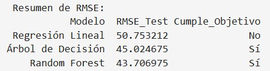

 
 
 

## **Descripción del proyecto**
La compañía Sweet Lift Taxi ha recopilado datos históricos sobre pedidos de taxis en los aeropuertos. Para atraer a más conductores durante las horas pico, se requiere predecir la cantidad de pedidos de taxis para la próxima hora. 

 
 
 

## **Objetivo del proyecto**
La secuencia del proyecto fue la siguiente:

* Se cargaron los conjuntos de datos y se realizo un analisis exploratorio. Como es un serie temporal se transformo a horas y días para visualizar las gráficas de mejor manera. 

* Se verificó visualmente por estacionalidad, se observó la serie de tiempo a diferentes tiempos, se observó la tendencia a diferentes tiempos  y finalmente, se observaron los residuales a diferentes tiempos.

* Se entrenaron diferentes modelos de predicción usando el conjunto de datos de entrenamiento, obteniendo los mejores parametros para cada modelo.

* Finalmente, se validaron los modelos con los mejores parámetros usando el conjunto de datos de prueba, buscando obtener el métrico de raíz del error cuadrático medio (RECM) menor a 48.
 
 
 

## **Lenguajes y herramientas usadas**
Plataforma: Jupyter Notebook

Lenguajes: Python

Librerias: Pandas, Matplotlib, Numpy, Statsmodels, Scikit-learn

Modelos utilizados: Regresión lineal, Bosque aleatorio y Arbol de decisión.
 
 
 

## **Conclusiones**  
En la tabla siguiente se puede  observar que de los 3 modelos evaluados con el conjunto de prueba (10% de conjunto original), solo 2 cumplen con el objetivo de estar por debajo de 48 de RMSE. Los modelos de arbol de decision y bosque aleatorio son los que cumplen con el requisito del proyecto, si se tuviera que elegir entre alguno de los dos se elegiria el de bosque aleatorio que es el que esta mas debajo de 48.

Dentro del análisis se realizo una revisión del comportamiento de órdenes por hora del período de Marzo a Octubre de 2018, primeramente obteniendo la informaciín directa, sin agregar ningín parímetro adicional:

Posteriormente, se obtuvieron las medias y desviaciones estandard por día, de esta manera pudimos observar una tendencias y de cierta manera estacionalidad más clara:

